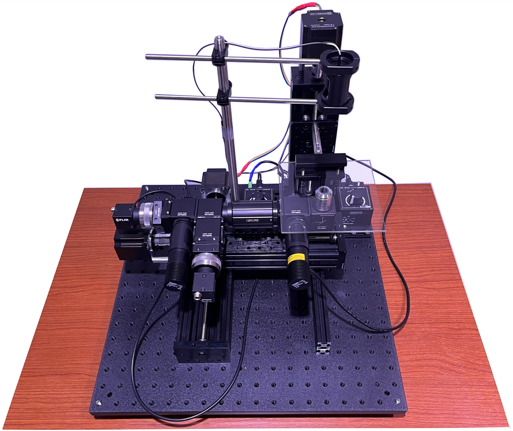
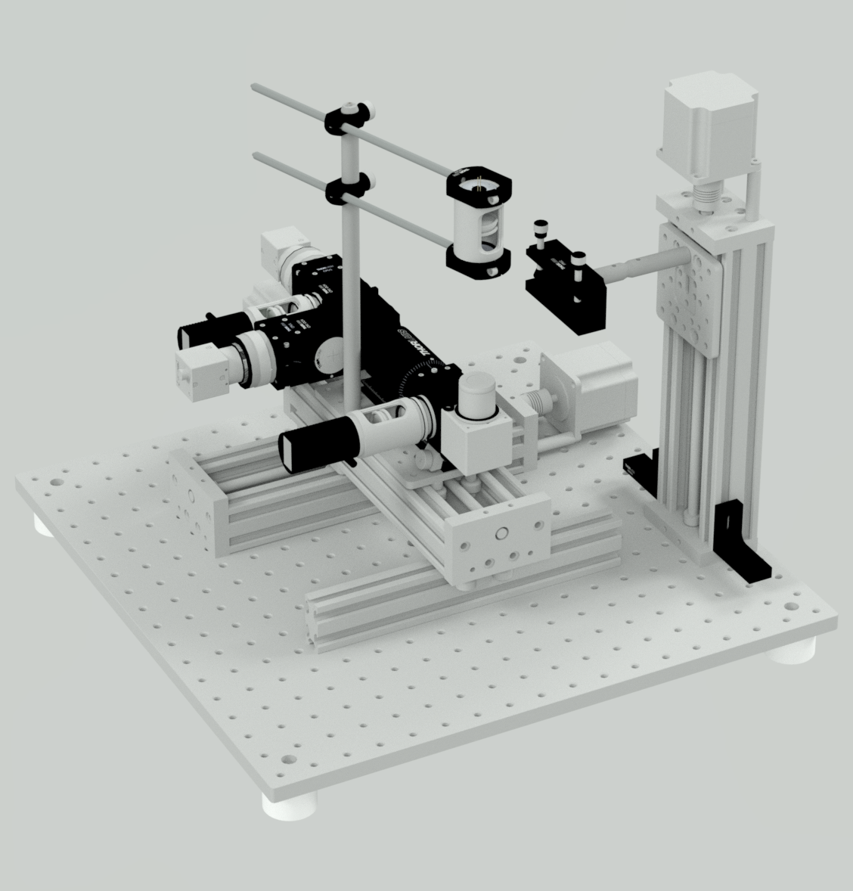

# OpenAutoScope2.0

  

# About

Introducing OpenAutoScope2.0: a compact dual-channel microscope engineered to enable precise tracking of a single c.elegans and facilitate optogenetic experiments. This imaging system excels in recording the behavior and gcamp signal of the specimen, while simultaneously delivering controlled light stimuli for comprehensive investigations. Leveraging a combination of image processing techniques and convolutional neural networks, OpenAutoScope2.0 demonstrates exceptional proficiency in detecting the worm's head for reliable hours-long tracking.

# Hardware Design
add the light path schematic drawing. talk about the pcb, stepper motors and so on.

  

# Software Design
add the schematic chart of the zmq system

# Tracker Design 
mention the ResNet18 architecture and how we it. 
