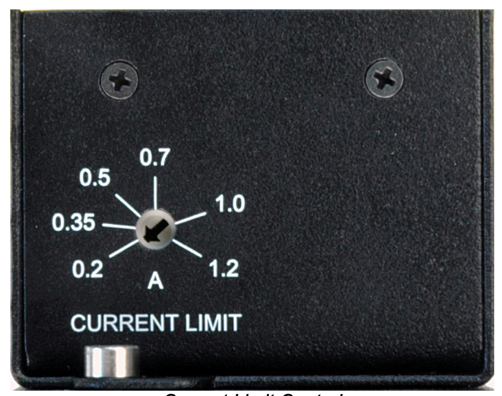

# Calibration and Parameter settings

If you've reached this point, we assume that you have completed the hardware assembly, installed the software, familiarized yourself with the parameter file, 
read about how to utilize the GUI or Xbox controller for stage movement.

### Power Supply

To ensure functionality, three devices must be connected to power supplies. The PCB board and two LED controllers require individual power sources. 
For the PCB board, use the 5A power supply. As for the LED controllers, the power adapter provided by Thorlabs is suitable for their operation.

### LED Contoller

To determine the maximum allowed current for the 470nm LED and the 595nm LED, refer to their respective specification sheets. These documents provide information
regarding the recommended operating conditions. Additionally, on the back of each LED controller, you will find a potentiometer that enables you to set the maximum output current.
To adjust the current, use a small flat screwdriver to turn the potentiometer. Carefully rotate it until you reach the desired maximum output current level for each LED. 

  

